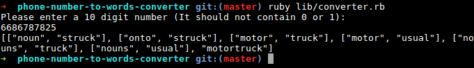

# Phone Number To Words Converter

The project is a Ruby script which takes an input of a 10 digit phone number and converts into meaningful words by performing keypad's letter combinations against a dictionary file

#### Contents
 - Assumptions
 - Installation
 - Execution
 - Output Screen

## Assumptions

  - Number should be 10 digits
  - Number should not contain 0 & 1 digits
  - The matching word's length is atleast 3 characters
  - This application is using a standard keypad

## Installation
  - Clone the repository
  - Got to repository folder: `cd phone-number-to-words-converter`
  - Install ruby 2.3.1
    - Using RVM: `rvm install 2.3.1` (Refer: https://www.digitalocean.com/community/tutorials/how-to-install-ruby-on-rails-on-ubuntu-14-04-using-rvm)
    - Using Rbenv: `rbenv install 2.3.1` (Refer: https://www.digitalocean.com/community/tutorials/how-to-install-ruby-on-rails-with-rbenv-on-ubuntu-16-04)
  - Install `bundler` gem using `gem install bundler`
  - Get all dependencies: `bundle install`

## Execution
  - Run the program: `ruby lib/converter.rb`
  - Run the tests: `rspec spec --format documentation`

## Output screen

